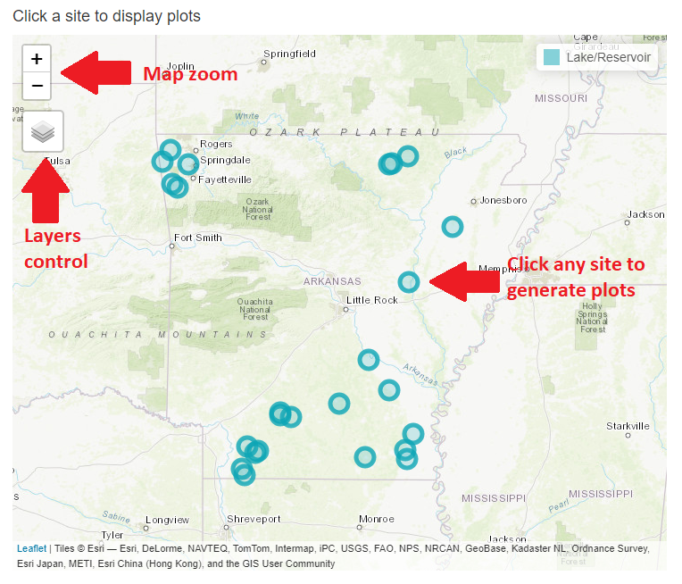

## Introduction

This application is designed to interactively visualize lake profile data collected by ADEQ.

\
Disclaimer: This app is a DRAFT modified from the original app created by Utah DWQ. Source code and additional information for the original application are available via the [DWQ Lake Profile Dashboard GitHub repository](https://github.com/utah-dwq/LakeProfileDashboard) .\
This application is available under an [MIT license](https://github.com/utah-dwq/LakeProfileDashboard/blob/master/LICENSE) .\
 

## Deploying the app and hosting:

Currently this app utilizes [shinyapps.io](shinyapps.io) to host and deploy on a publicly accessible URL.
Shinyapps.io has several pricing plans for hosting apps - the current plan is free and has a maximum of 5 apps and 25 active hours/month.
There are several other pricing points with increasing number of applications and active hours, however only the highest tier allows custom domains.

There are other options for hosting, such as [Shiny Server](https://posit.co/products/open-source/shiny-server/), and IT may have their own solutions.

After deploying to an active URL, the app can be embedded directly into any ADEQ webpage using an [HTML iframe](https://shiny.oxshef.io/deploy_embedding-shiny-apps).
Thus a custom domain may not be necessary, but we will likely need to create a shinyapps.io account for ADEQ and subscribe to a higher tier for more active hours.

## Data

Data must be updated by ADEQ manually.
Set interval for uploading new data?

The data used in this application are collected as water column profiles at lake sites throughout Arkansas.
Lake profiles consist of measurements of dissolved oxygen, temperature, and pH at regular depth intervals through the water column.
Data have been pre-processed to ensure consistency in parameter names and units.
 

## Application usage

The application has two main inputs: a map and a table.
To build plots for any individual site, click on your desired site in either the map or the table.

The map shows all sites with profile data available.
The table shows all of those sites and their associated uses and assessments for each parameter.
The map and table inputs are responsive to each other.
When you click a site on the map, the table will automatically filter to assessments associated with that site.
When you click on a row in the table, the map will automatically fly to that site location.

Plots specific to that site will be rendered automatically.
Outputs will automatically render any time the user updates one of the input widgets.
 

## Map elements

Individual monitoring locations are displayed as circle markers on the map.
By default, only locations with available data are shown.
In addition to displaying sites with profile data, all lake monitoring sites are available as a map layer.
Topographic and satellite base layers are both available.
To turn on any of these layers, hover the mouse over the layers control box (top left of map, under zoom buttons) and select one or more layers.

\
Figure 1.
Map usage guide.
   

## Outputs

### Individual profiles

The "Individual profiles" tab shows two outputs for a single profile collected at the selected site and date.
The first is a plot of temperature, dissolved oxygen, and pH against depth, with calculated thermocline (if possible).
The second output is a scrollable table of the data from that profile used to generate the plot.
 

### Site profiles (all dates)

The "Site profiles" tab shows three outputs for a single site.
Plots of DO (mg/L), pH, and Temperature (\*C) against depth are displayed across all available dates.
The date ranges used in these plots can be adjusted with the date range slider at the top of the page.
These profile plots are useful for comparing parameter changes over time.

## Help & feedback

Contact information for help/feedback here

[Official Webpage for Arkansas Division of Environmental Quality - Office of Water Quality](https://www.adeq.state.ar.us/water/)

Modified by Tanner Senti, Arkansas Division of Environmental Quality

Original app by Jake Vander Laan, Utah Division of Water Quality
